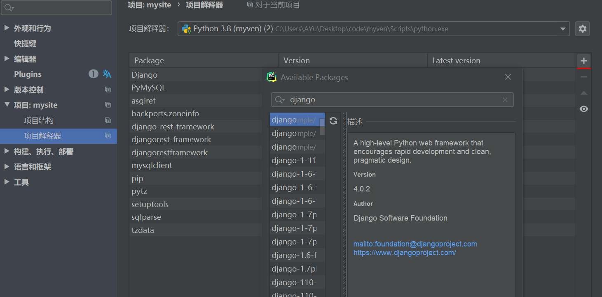
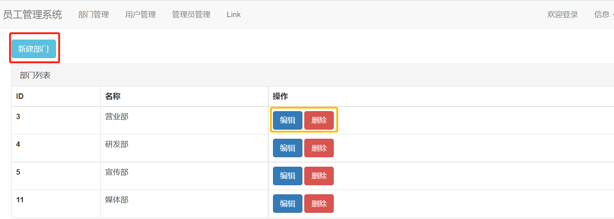
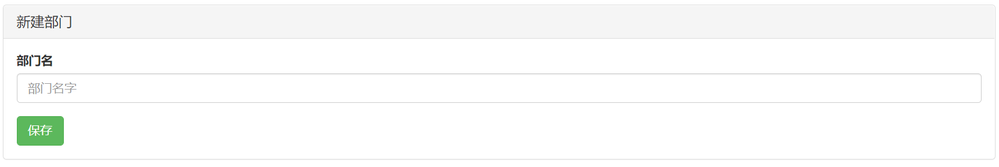
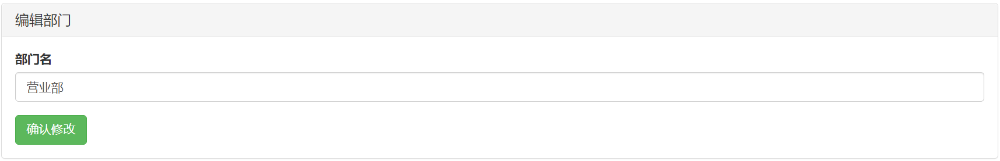
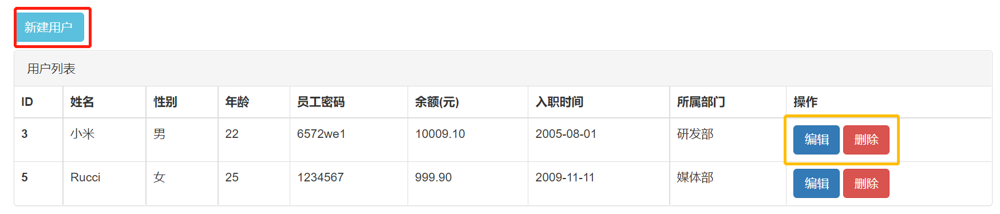
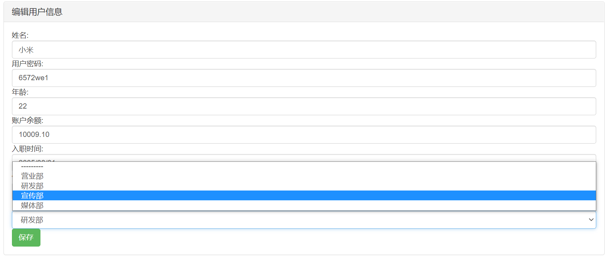
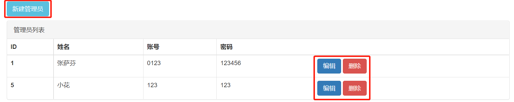
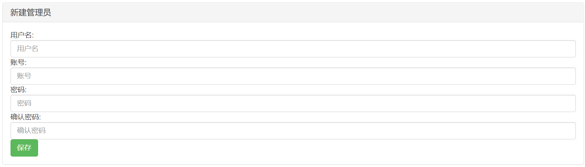
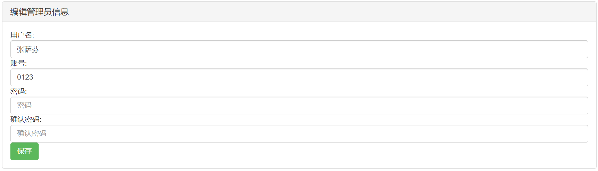
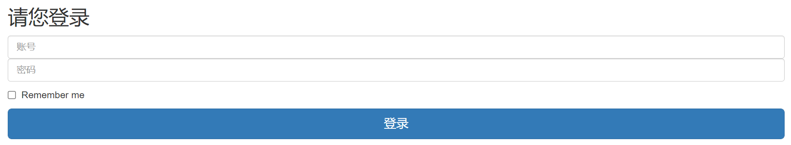

# 用户管理系统
*[English](/docs/README-en.md) ∙ [简体中文](README.md)*
## 目的🙋‍♀️🙋‍♂️
- 通过此次项目，对如何使用django搭建web有初步认识。
## 开发环境
- 虚拟环境下运行python3.8 可视化界面：Pycharm2015
- 数据库：Mysql8.0
## 初步实现的功能：

- [对部门信息的增删改查](#Depart)
- [对员工信息的增删改查](#UserInfo)
- [对管理员信息的增删改查](#Admin)

## 遇到的问题
- [login登录界面内，账号密码即使比对成功也不进行跳转](#error)

## 安装
- Mysql安装具体请参考 [mysql](https://www.mysql.com/)。
- pycharm安装具体请参考 [pycharm](https://www.jetbrains.com/pycharm/)。
- BootStarp使用教程请参考[BootStarp](https://getbootstrap.com/)

使用pip安装： `pip install -Ur requirements.txt`

使用pycharm安装包：


虚拟环境搭建：
命令窗口：
- python -m venv （虚拟环境文件名） ...
使用pycharm运行虚拟环境：
- 参考教程[pycharm运行虚拟环境](https://blog.csdn.net/xp178171640/article/details/115916940)

## 数据库连接

 修改`mysite/setting.py` 修改数据库配置，如下所示：

```python
DATABASES = {
    'default': {
        'ENGINE': 'django.db.backends.mysql',
        'NAME': 'myweb',
        'USER': 'root',
        'POST': 3306,  # 端口号
        'PASSWORD': 'wkr115217',
        'HOST': 'localhost'
    }
}
```

### 创建数据库
a.mysql数据库中执行:
```sql
CREATE DATABASE myweb； 
```

然后终端下执行:
```bash
./manage.py makemigrations
./manage.py migrate
```
b.因为终端下执行需要找到manage.py文件，可以使用pycharm：tools-run manage.py：

```
./makemigrations
./migrate
```

**注意：** 在使用 `./manage.py` 之前需要确定你系统中的 `python` 命令是指向 `python 3.6` 及以上版本的。如果不是如此，请使用以下两种方式中的一种：

- 修改 `manage.py` 第一行 `#!/usr/bin/env python` 为 `#!/usr/bin/env python3`
- 直接使用 `python3 ./manage.py makemigrations`

## User

### 表的建立：
``` python
class Department(models.Model):
    # 部门表 verbose_name==对列名注解
    title = models.CharField(verbose_name='部门名', max_length=32)
    '''通过__str__(self)返回获取的对象中的某个值，很重要'''

 	  def __str__(self):
       return self.title
```
### 功能界面


#### 新增部门


#### 编辑部门
- 编辑前默认显示当前部门名


#### 删除部门
- 只需要按对应的删除按钮即可

## UserInfo

### 表的建立：
``` python
class Userinfo(models.Model):
    """员工表"""
    name = models.CharField(verbose_name='姓名', max_length=16)
    '''性别只有两个选择,在django中做约束'''
    sex_choices = (
        (1, '男'),
        (2, '女'),
    )
    sex = models.SmallIntegerField(verbose_name='性别', choices=sex_choices)
    age = models.IntegerField(verbose_name='年龄')
    password = models.CharField(max_length=64, verbose_name='用户密码')
    account = models.DecimalField(verbose_name='账户余额', max_digits=10, decimal_places=2, default=0)
    '''整数部分最多10位，小数部分最多2位，默认0'''
    creat_time = models.DateField(verbose_name='入职时间')
    # 级联删除
    depart = models.ForeignKey(to='Department', to_field='id', on_delete=models.CASCADE)
   
```
### 功能界面


#### 新增用户


#### 编辑用户信息
- 编辑前默认显示当前用户的信息


#### 删除用户
- 只需要按对应的删除按钮即可

## Admin

### 表的建立：
``` python
class AdminInfo(models.Model):
    name = models.CharField(verbose_name='用户名', max_length=16)
    admin = models.CharField(verbose_name='账号', max_length=16)
    password = models.CharField(verbose_name='密码', max_length=16)

```
### 功能界面


#### 新增管理员


#### 编辑管理员信息
- 默认显示姓名和账号
- 要求两次密码输入一致才能进行保存


#### 删除管理员
- 只需要按对应的删除按钮即可

## error
- login界面展示

- 自己也在试着分析，但是目前还没有找到原因。如果哥哥有时间也可以帮我下撒。


### 附件（一些知识积累）
- 见库中“django中新学习的常用函数.docx”

### 后期计划
- 把这个入门的Web完成后，增加如下功能：
   - 密码加密，存到数据库
   - 用户登录的图形验证
   - 数据比对功能完善
  
- 进入下一阶段，试着做一个有趣的网站（类似人人网、微信...）


